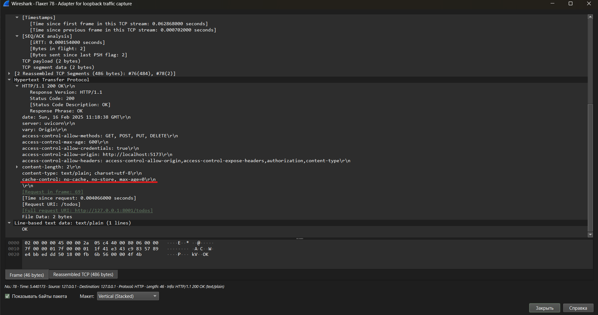
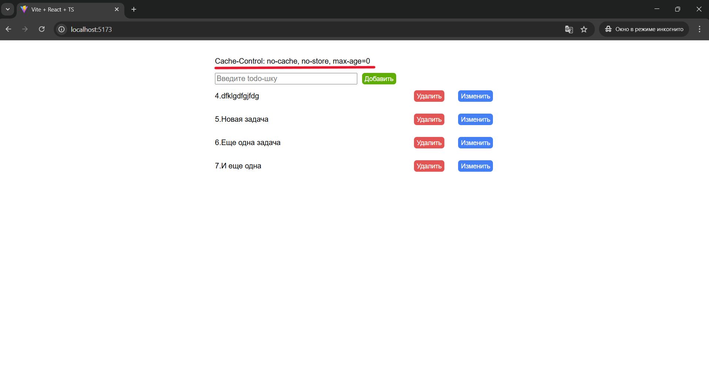
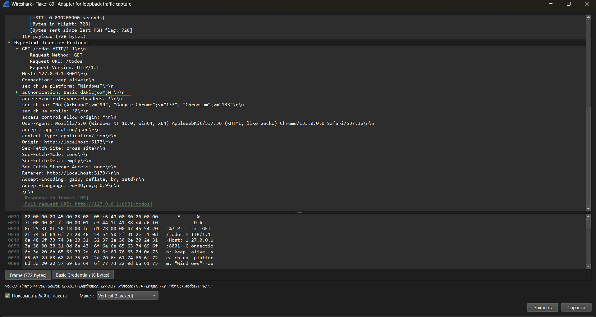
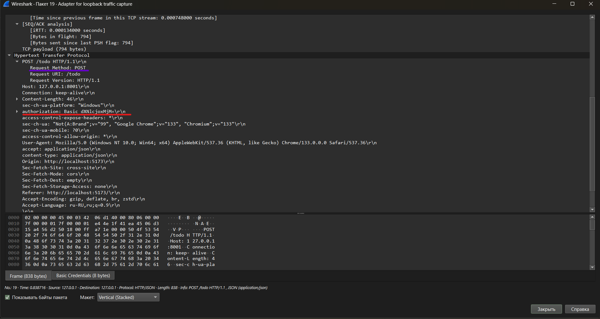
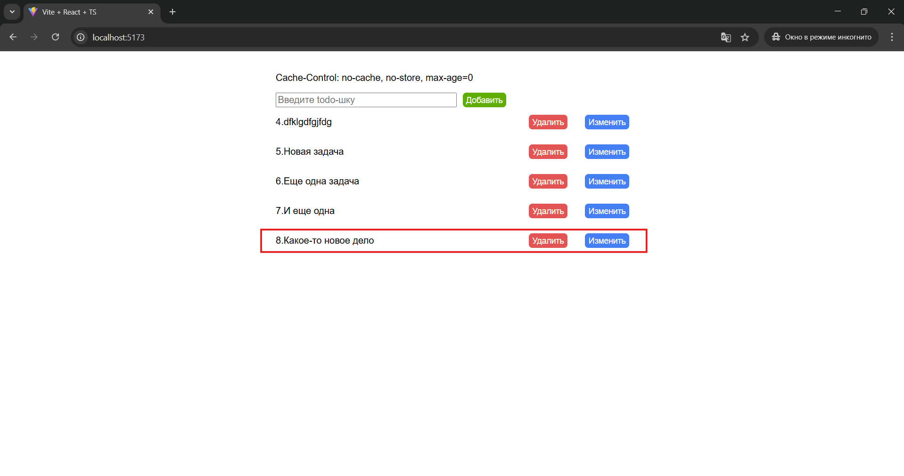
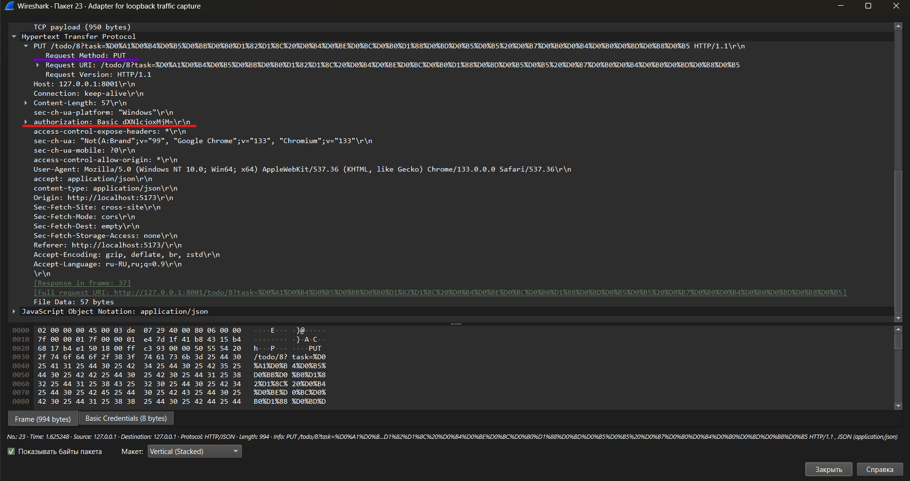
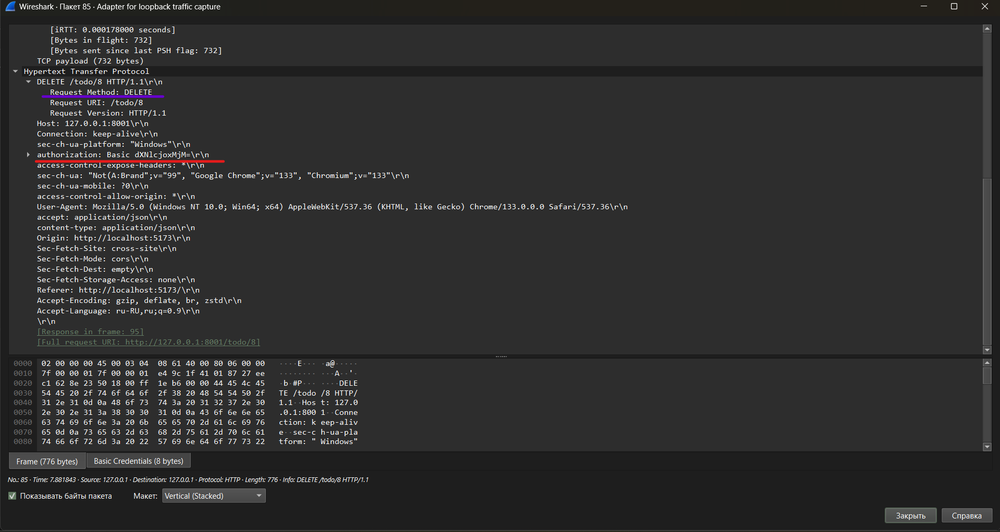
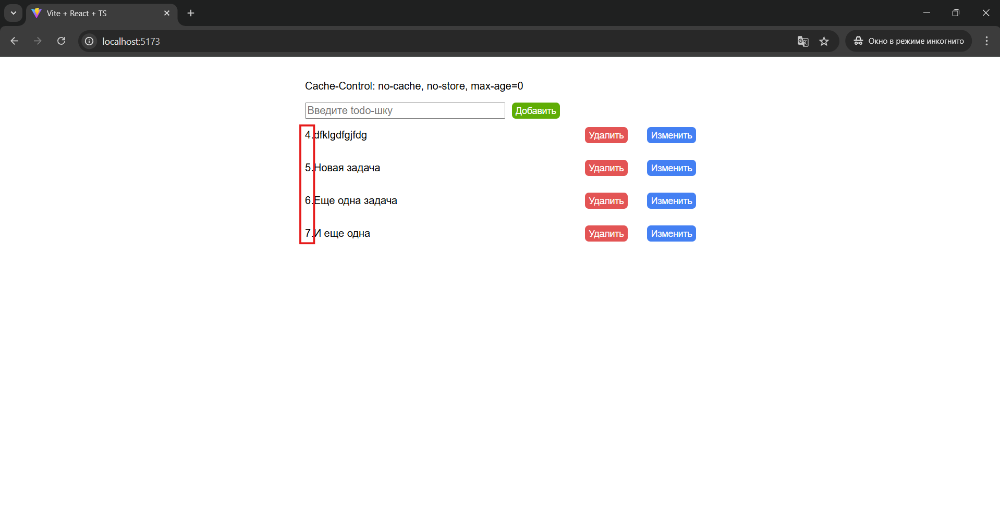

# О приложении
Приложение представляет собой список дел.
При переходе на страницу со списком дел происходит проверка пользователя. Если данных о пользователе нет, то откроется страница с авторизацией.
Метод авторизации - Basic HTTP Auth. В качестве СУБД используется SQLite.
Данные для проверки: логин: user, пароль: 123

Соблюдение требования использования Basic HTTP Auth достигается за счет заголовка запроса `Authorization: Basic [encoded_username:encoded_password]`.
`encoded_username:encoded_password` - это закодированные в формате base64-строки логина и пароля, указанных при авторизации.
После авторизации эти данные запоминаются в памяти приложения и аналогичным образом передаются при любом запросе на сервер. Каждый эндпоинт сервера также является защищенным, ожидая логин и пароль.

## Анализ HTTP-трафика
Одно из требований к лабораторной работе - проанализировать заголовок Cache-Control. Пример приведен на рисунке ниже:

По заданию требуется проанализировать заголовок `Cache-Control` на стороне клиента. Клиентская часть приложения выводит значение этого заголовка каждый раз при новом запросе.

Так как приложение поддерживает CRUD-операции, то проанализируем HTTP-трафик для остальных операций - POST, PUT и DELETE.

1. GET-запрос
    
    Приведенный на рисунке выше запрос выполняется после перехода на главную страницу приложения. Запрос возвращает весь список дел из таблицы `todos`.
2. POST-запрос:
    
    Для отправки POST-запроса пользователю необходимо заполнить поле ввода и нажать на кнопку "Добавить", после успешного выполнения запроса в графическом интерфейсе отобразится добавленная задача.
    
3. PUT-запрос:
    
    Для отправки PUT-запроса пользователю необходимо нажать кнопку "Изменить" рядом с нужной задачей, ввести новое значение в `Prompt` браузера и нажат "ОК".
    После успешного обновления данных графический интерфейс отобразит обновленное значение.
4. DELETE-запрос:
    
    Для отправки DELETE-запроса пользователю необходимо нажат кнопку "Удалить" рядом с нужной задачей.
    После успешного выполнения запроса выбранная задача исчезнет.
    

